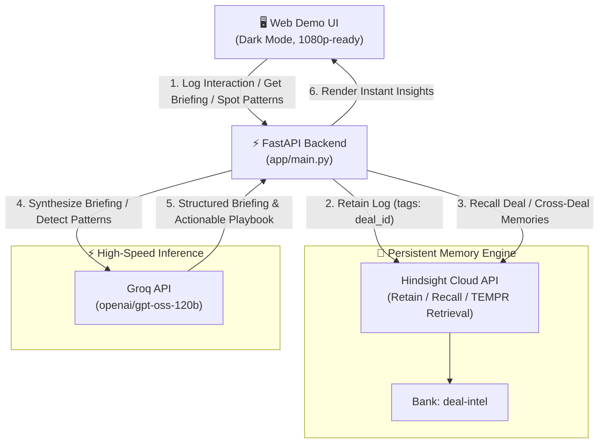

# Deal Intelligence Agent 💼🤖

> **Autonomous Sales Memory & Cross-Deal Pattern Intelligence powered by Hindsight Cloud and Groq.**

Sales reps waste hours before every call re-reading fragmented CRM notes, slack threads, and email chains. **Deal Intelligence Agent** solves this by maintaining persistent memory across every call, email, and meeting log. It recalls full deal history on demand, briefs reps in seconds, and proactively surfaces cross-deal patterns (e.g., *"price objections close faster when offering annual upfront billing with a 15% discount"*).

---

## 🏗️ Architecture



---

## ⚡ Tech Stack

| Component | Technology | Role |
|-----------|------------|------|
| **Memory Engine** | **Hindsight Cloud** (`hindsight-client` / REST) | Persistent semantic memory, memory tagging by `deal_id`, multi-strategy recall |
| **LLM Inference** | **Groq** (`openai/gpt-oss-120b`) | Ultra-fast deal briefings, objection synthesis, and cross-deal pattern mining |
| **Backend** | **Python (FastAPI)** | High-performance asynchronous REST API |
| **Frontend UI** | **Vanilla HTML5 + Modern CSS + JS** | Responsive, dark-mode, zero-build, screen-record ready at 1080p |
| **Storage** | **Flat JSON Store (`deals.json`)** | Local cache for synthetic deal metadata and offline inspection |

---

## 🚀 Quickstart & Setup

### 1. Prerequisites
- Python 3.10+ installed
- Hindsight API key (`hsk_...`) from [Hindsight Cloud](https://ui.hindsight.vectorize.io)
- Groq API key (`gsk_...`) from [Groq Console](https://console.groq.com)

### 2. Clone & Setup Virtual Environment

```bash
# Navigate to project
cd deal-intel-agent

# Create virtual environment
python -m venv .venv

# Activate environment
# On Windows (PowerShell):
.venv\Scripts\Activate.ps1
# On macOS / Linux:
source .venv/bin/activate
```

### 3. Install Dependencies

```bash
pip install -r requirements.txt
```

### 4. Configure Environment

Copy the example file to `.env` and verify your API keys:

```bash
cp .env.example .env
```

Your `.env` should look like:

```ini
GROQ_API_KEY=gsk_...
HINDSIGHT_API_KEY=hsk_...
HINDSIGHT_BASE_URL=https://api.hindsight.vectorize.io
HINDSIGHT_BANK_ID=deal-intel
GROQ_MODEL=openai/gpt-oss-120b
```

### 5. Seed Synthetic Deals into Hindsight

Populate realistic sales deals with chronological objection-resolution arcs:

```bash
python scripts/generate_synthetic_deals.py
```

### 6. Start the Application

```bash
uvicorn app.main:app --reload --port 8000
```

Open your browser at **`http://localhost:8000`**.

---

## 🎬 3-Minute Demo Video Recording Arc

Record this exact progression for your video demo:

### 📍 Interaction 1 — The Cold Start (New Deal)
1. Select **`FinVault Security (deal_004)`** from the dropdown.
2. Click **"Get Deal Briefing"**.
3. **Observation:** The agent acknowledges this is a new opportunity with no history yet, advising a discovery call to map stakeholders and pain points.

### 📍 Interaction 2 — Ingesting Live CRM Notes
1. In the **"Log Interaction"** box for `deal_004`, type:
   > *"Call with Vikram Rao: Vikram loves the product, but mentioned their budget is strictly frozen unless we can provide an annual upfront discount."*
2. Click **"Retain to Hindsight"**.
3. **Observation:** The memory is immediately committed to Hindsight Cloud.

### 📍 Interaction 3 — Precision Recall Under Pressure
1. Switch to **`ApexLogistics (deal_001)`**.
2. Click **"Get Deal Briefing"**.
3. **Observation:** The agent instantly recalls:
   - Specific objections from Marcus Vance (CFO) regarding $6k/mo cost.
   - Competitive pressure from **LegacyFreight** (25% cheaper).
   - How the rep closed the deal with annual prepaid terms and a 15% discount.
   - Actionable next talking point for the upcoming call.

### 📍 Interaction 4 — Cross-Deal Pattern Intelligence
1. Click **"Spot Cross-Deal Patterns"**.
2. **Observation:** Instead of just single-deal recall, Hindsight performs a global recall across all deals. Groq LLM detects the recurring pattern:
   - **Pattern:** *"When CFO or procurement objects to price/competitor quotes, countering with annual prepaid billing + 15% discount + waived onboarding fee turns stalled deals into Closed-Won."*
   - Surfaces a clean comparison table between **ApexLogistics** and **CloudScale Systems**, and provides an actionable playbook rule for the entire sales team.

---

## 📡 API Reference

### `GET /deals`
Returns a list of all active deals.
```json
[
  {
    "deal_id": "deal_001",
    "company": "ApexLogistics",
    "rep_name": "Alex Rivera",
    "deal_value": "$72,000"
  }
]
```

### `POST /deals/{deal_id}/log`
Retains an interaction into Hindsight Cloud and appends to local store.
```bash
curl -X POST http://localhost:8000/deals/deal_001/log \
  -H "Content-Type: application/json" \
  -d '{"text": "Procurement meeting agreed on annual terms."}'
```

### `GET /deals/{deal_id}/brief`
Recalls memories from Hindsight scoped to `deal_id` and produces a structured briefing.
```bash
curl http://localhost:8000/deals/deal_001/brief
```

### `GET /patterns`
Recalls all deal memories across the bank and synthesizes cross-deal patterns and playbook rules.
```bash
curl http://localhost:8000/patterns
```

---

## 🧪 Automated Testing & Verification

Run the full dry-run test suite:

```bash
python scripts/verify_endpoints.py
```
